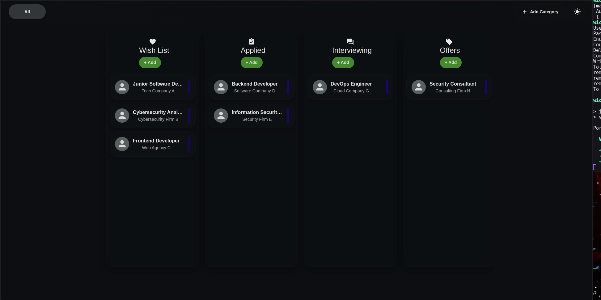

# Job Application Tracker (Work in Progress - Not Production Ready)

A Kanban-style full-stack job search tracker built to manage real job applications from wishlist to archive.

This project was built to practice modern full-stack application architecture, UI workflows, and rapid feature iteration using React, TypeScript, and FastAPI.

## Screenshots



## Why I Built This

Applying for jobs across multiple platforms gets messy fast. I wanted a focused tool where I can:

- Track each role by stage (`Wish List`, `Applied`, `Interviewing`, `Offers`, `Rejected`, `Archived`)
- Move applications quickly with drag and drop
- Keep role-specific notes in one place
- Maintain visibility of my job pipeline and next actions

## Features

- Multi-column job board by application stage
- Drag-and-drop stage transitions
- Add new job entries with form modal
- Job details side panel/window
- Light/Dark mode toggle
- Responsive horizontal board layout
- Category-based organization
- Image/logo upload support
- Frontend/backend API integration

## Tech Stack

### Frontend

- React 19
- TypeScript
- Vite
- Material UI (MUI)
- dnd-kit (`@dnd-kit/react`)

### Backend

- FastAPI
- SQLAlchemy
- SQLite
- Pillow

### Tooling

- ESLint
- TypeScript build (`tsc -b`)

## Project Structure

```text
src/
├── components/
├── services/
├── types/
├── utils/
├── App.tsx
└── main.tsx

backend/
├── api/
├── auth/
├── db/
├── models/
├── repositories/
├── schemas/
├── services/
├── static/
│   └── thumbnails/
└── main.py

screenshots/
public/
README.md
```

## Getting Started

### 1) Clone

```bash
git clone <your-repo-url>
cd "job-application"
```

### 2) Install dependencies

```bash
npm install
```

### 3) Run locally

```bash
npm run dev
```

Open the local URL shown in your terminal (usually `http://localhost:5173`).

## Scripts

- `npm run dev` — Start local development server
- `npm run build` — Type-check and build for production
- `npm run preview` — Preview production build locally
- `npm run lint` — Run ESLint

## Status

Currently under active development.

Planned next steps:

- Authentication and user accounts
- Persistent cloud database
- User-specific application data separation
- Search/filtering and analytics
- CI/CD pipeline
- Improved mobile responsiveness

## What I Learned

- Building reusable typed React components
- Managing frontend/backend integration
- Structuring API services cleanly
- Implementing drag-and-drop workflows
- Handling relational data models
- Iterating quickly while maintaining readable architecture

## Portfolio / CV Blurb

Built a full-stack job application tracker using React, TypeScript, FastAPI, SQLAlchemy, and Material UI. Implemented drag-and-drop workflows, image upload handling, reusable typed components, frontend/backend API integration, and responsive Kanban-style UI architecture.

## License

MIT
